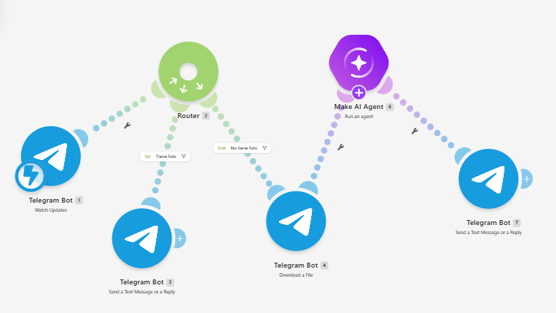

# Nombre del proyecto
Chatbot de Identificación de Flora y Fauna mediante Imágenes

## Descripción
El objetivo de este código expone cómo procesar una fotografía enviada por un usuario para identificar la especie de animal, insecto o planta presente en la imagen.
## Objetivos de aprendizaje
Programar y simular el flujo de procesamiento de un chatbot para analizar imágenes de entrada, clasificarlas mediante modelos de reconocimiento de imagen e identificar especies biológicas (plantas, insectos y animales) generando una respuesta perceptible y detallada al usuario.

## Diagrama del circuito

## Código
[Readme](Codigo/IntegrationTelegramBot.blueprint.json)

## Video del funcionamiento

[Readme](Video/readme.txt)

[Ver video en YouTube]([https://www.youtube.com/watch?v=T5Aq7cRc-mU](https://www.youtube.com/watch?v=r36q2z-AkHk&sttick=0)

## Reporte
Incluye:
[Resultados.pdf](Reporte/ReportedeResultados.pdf)

- Gráficas (insertar imagen o link)
- Tablas de datos
- Observaciones sobre el comportamiento del sistema

## Conclusiones
La práctica permitió reforzar el uso de las funciones básicas de procesamiento de entradas multimedia y clasificación en la arquitectura del chatbot, así como comprender el flujo lógico de comunicación: la importancia de que la imagen sea correctamente preprocesada para que el modelo cumpla su función de segmentación y extracción de características. Este tipo de error es común en entornos de desarrollo y resalta la importancia de verificar la calidad del dato de entrada, no solo la ejecución aislada del modelo de inteligencia artificial.

## Resultados
[Resultados.pdf](Resultados/readme.md)

Este documento contiene la descripción de la práctica, objetivos y procedimientos realizados.

- Reporte técnico estilo IEEE (PDF)
- Datos CSV (si aplica)
- Diagramas adicionales
